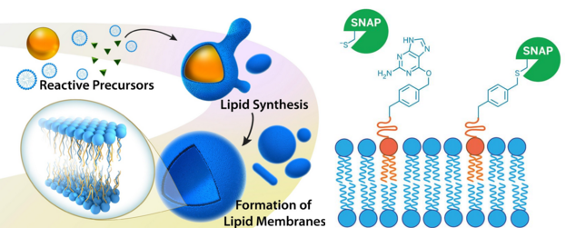
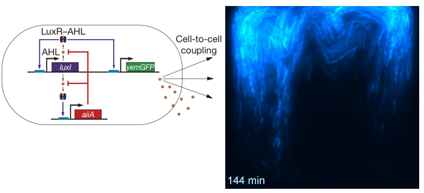
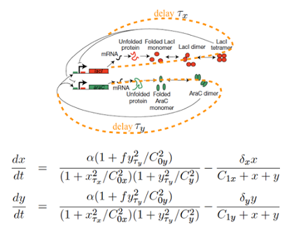

Introduction
=====================
* * *

The goal of our multidisciplinary university research initiative (MURI) is to combine biological elements (ribosomes, DNA, RNA, and proteins) with synthetic materials in order to create hybrid artificial “cells” capable of mimicking the form and function of natural cells but with improved control, stability, and simplicity. Mastering the capabilities of living systems is a scientific grand challenge that could catalyze the discovery, design, and synthesis of new materials. Biomimetic research has long aimed to create artificial cells consisting of minimal biochemical elements yet capable of performing functions with the extraordinary ability of naturally occurring cellular systems. An attractive route is to develop hybrid cells consisting of artificial supramolecular structures fully integrated with biological elements. For this purpose, we have assembled a multi-investigator, interdisciplinary team consisting of chemists, physicists, engineers, and biologists. Our strategy will be to substitute the organizing elements of the cell such as the internal organelles, motors, cell membrane and cytoplasm, with artificial constructs. We will then study how to embed biological circuits capable of interacting and controlling the artificial components.

Our MURI effort is divided into several major thrusts, which are all interrelated. We briefly summarize these efforts below.

## Thrust 1
* * *
#### Interfacing Synthetic Phospholipid Membranes with Biochemical Reactions

We propose to substitute the native lipid organizing structure of natural cells with synthetic phospholipid membranes, created using chemoselective chemistries such as copper catalyzed azide-alkyne cycloaddition or native chemical ligation. The use of “bioorthogonal” reactions will enable lipid synthesis to occur concurrently with biochemical pathways and circuits. We are also exploring the development of approaches to target/sequester biomolecules to synthetic membranes. Tools enabling spatiotemporal control of biomolecule immobilization will allow the elucidation of the impact of sequestration/immobilization on biological activity.

## Thrust 2
* * *
#### Optimizing Protein Synthesis within Synthetic Supramolecular Structures

Protein synthesis is a fundamental process in all-living organisms. Ribosomes are the macromolecular complexes responsible for protein synthesis and they consist of three RNA molecules (16S rRNA, 23S rRNA and 5S rRNA in bacteria) and more than 50 ribosomal proteins. In addition, protein synthesis needs initiation factors (IF1, IF2, and IF3), elongation factors (EF-Tu, EF-Ts, and EF-G), termination factors (RF1, RF2, and RF3) and a recycling factor (RRF). Eukaryotic protein synthesis is much more complex than bacterial translation and requires more than thirty different polypeptides just for the initiation step of protein synthesis. Therefore, we will use bacterial components to reconstitute cell-free translation inside vesicles.

## Thrust 3
* * *
#### Interfacing Biologial Circuits with Synthetic Membranes

Synthetic biology aims to engineer genetic circuits in biological systems. In most cases, bacteria or yeast have provided the necessary cellular “chassis”  — enzymatic machinery, energy sources, and an enclosed membrane. Engineered circuits are designed to function independent of this chassis, yet the number of host background networks is typically orders of magnitude greater than that of the engineered design. Treating the host cell as an inert chassis is a safe approximation in some cases, yet it presents a fundamental limit on the robustness and complexity of our engineered designs due to unaccounted for host interactions and context dependent circuit performance. One solution is to construct “minimal cells” in which only the necessary biochemical components are combined with an artificial supramolecular chassis, thus eliminating all unwanted background activity. Embedding functional biological circuits within our proposed synthetic membranes presents an opportunity to create such hybrid abiotic-biotic artificial cells. The unifying long-term goal of these efforts will be the development of a fully abiotic, self-replicating cell with programmable genetic content.

## Thrust 4
* * *
#### Theoretical Modeling of Biological Circuit Interactions

Given the challenging, multi-disciplinary nature of the proposed project, we plan to employ a model-driven approach to the design of our hybrid synthetic/biological cells. Theoretical models will guide the experimental work and provide a deeper mechanistic understanding of the complex phenomena. Our team has extensive experience in using theoretical and computational modeling for designing operational synthetic biological circuits in vivo, and we will build upon this experience in our proposed study.

## Thrust 5
* * *
#### Spatiotemporal control over Membrane Synthesis

While there several methods to form synthetic membranes, the conventional methods for generating lipid species typically lack 4D control – 3D in space along with temporal control. While this deficit is often trivial from a purely small molecule synthetic point of view, the ability to have 4D control would enable us to resolve how local structure effects the formation and function of the proposed hybrid abiotic/biotic cells. We plan on developing methods to achieve 4D control over membrane synthesis. For the proposed research, 4D control of the desired reactions will be used to control vesicle formation, membrane structure and functionality, division, and creation of organelle-mimicking substructures.

## Thrust 6
* * *
#### Quantifying and Controlling Transport in Artificial Cells

The transport of materials inside cells is critical to controlling cell division, enzymatic activity, and the rates of nearly all biochemical reactions. Living cells have a number of mechanisms to regulate intracellular transport, the most studied of which are compartmentalization and molecular motors. We plan to harness advances in nanotechnology and materials science to to investigate the effects of active transport and macromolecular crowding on the reaction rates and segregation of biomolecules inside artificial cells.
